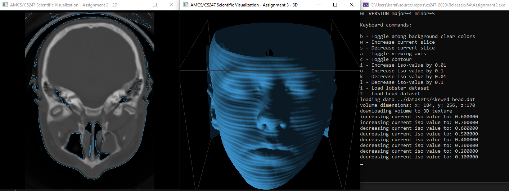

# Assignments 2+3

## General remarks
- Changed LoadData to keep the min and max value
- Changed DrawContour signature to keep aspect ratio
- Global contour stores 2d point tuples for marching squares contour lines
- Global vertices stores 3d points of triangles
- Global normals stores normal values of the vertices

## Marching Squares

There are 7 cases that need lines drawn due to symmetry. Only case 5 (and 10) need 2 lines to be drawn.
MarchingSquares selects the appropriate surrounding values and calls GetLinePoints which decides which
is the current square case, and calculates the 2d points of the contour. The position of each point on
the square’s edge is determined by the weights of the corner values.

Avoiding degeneracies can be achieved with setting an appropriate epsilon value while calculating the cubeIndex.
The idea is to introduce perturbations - if node value is equal to the contour, use value-e.

## Marching Cubes
With a similar concept, but in 3d space, MarchingCubes for each cube, created by adjacent points in space,
collects the vertex and normal values of its edges. Then it finds the appropriate cube case and according
to the edgeTable3D calculates  the triangle points for the vertex and the normal values.
The values are normalized between \[-1, 1].

Table offset provides a simple way to access the neighbors of a point in an iterative way.
For each point, collect neighboring points coordinates p and values val. 
Using these values, determine cube case cubeIndex

For each edge of the cubes, determine if a line should be drawn and calculate its points.

Table points is used to easily find the edges of each case.
For both methods, iso-value is normalized from \[min, max] to \[0, 1].
That means there will always be something to draw.
For low values, we can see skin tissue, medium values reveal the skull,
and the larger values show only the teeth.
The contour line is displayed only on the slice where the object lies.

## Parallelization
This algorithm can easily be parallelized, by splitting the 3d space to e.g. 8 subspaces.
Each computing node can calculate the internal points of the subspace, only the adjacent
perimeters need interprocess communication.

In this example, the process with the green subspace would have to send the edge values of the green cube
to the red, yellow, and blue processes. It would also receive the edge values of the adjacent cubes.
While waiting for communication, the internal values of the cube can run the marching cube algorithm as implemented.
The 3d space can be split in many ways, depending how many processes we can run in parallel.
