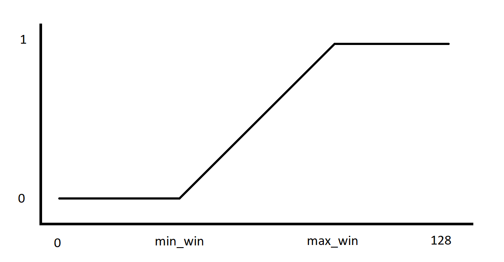
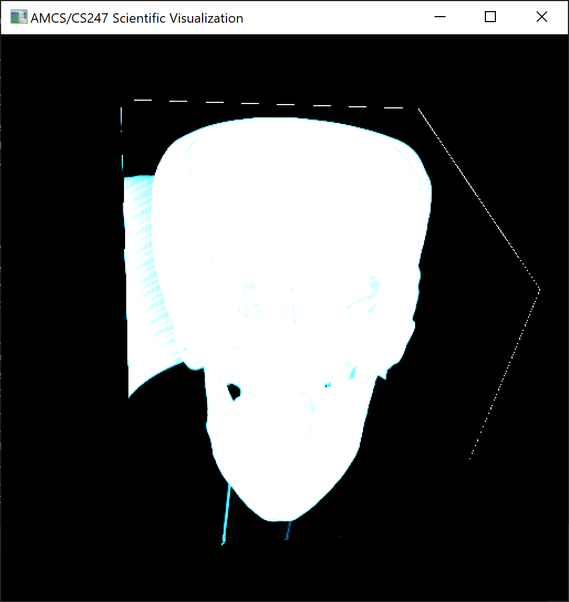
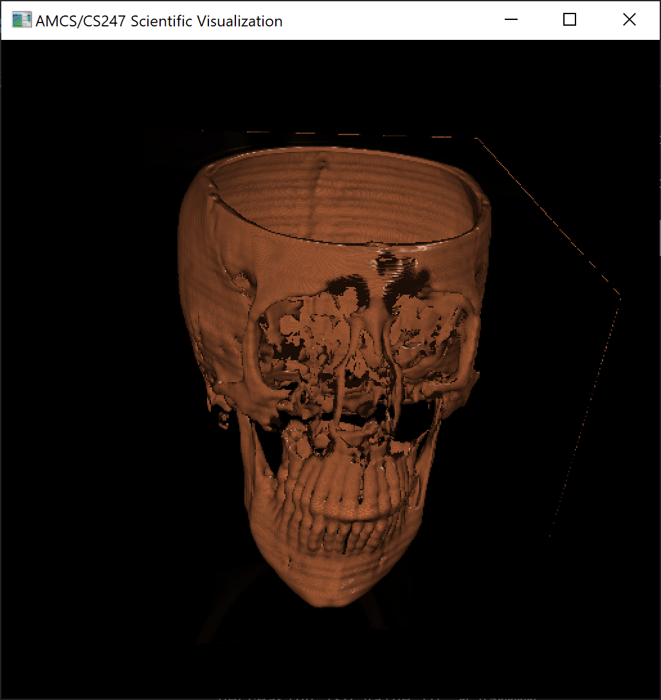
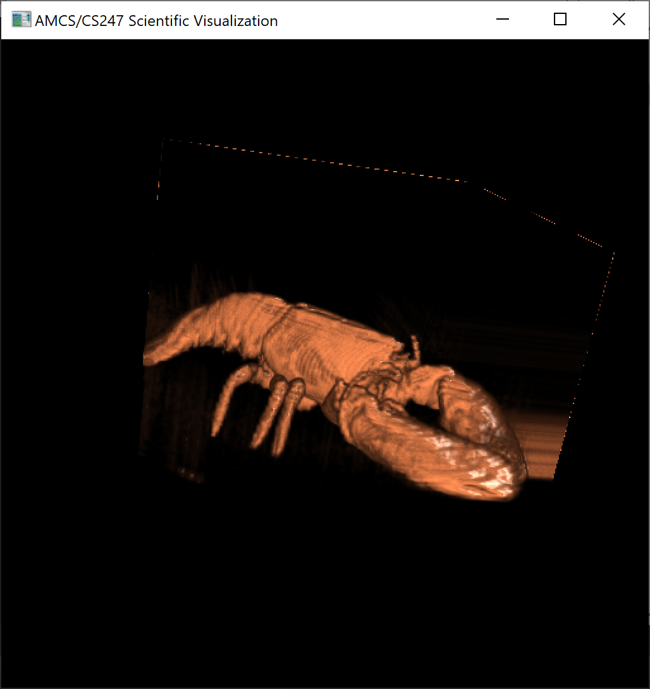

# Assignment 4

## Basic ray setup
Render front-faces and back-faces into textures.
Implement volume raycasting on the GPU (using fragment shaders). This implementation is based on the slides.
Perform single‐pass raycasting (front‐to‐back) by rendering the front‐ and back‐geometry using OpenGL
and then use these as input‐textures for a fragment shader that does the ray traversal.

## Opacity correction
The variable step_size is a user parameter and base_step_size is defined as a constant value.
```glsl
uniform float step_size;
float base_step_size = 0.0025f;

// Opacity correction
float opacity = 1 - pow(1 - value.a, step_size / base_step_size);
```

## Shading
Get the normals using central differences with delta as a small offset.
```glsl
float delta = 0.01;

void main() {
    // [...]
    vec3 norm;
    norm.x = texture3D(vol_texture, pos + vec3(delta, 0.0, 0.0)).x - texture3D(vol_texture, pos - vec3(delta, 0.0, 0.0)).x;
    norm.y = texture3D(vol_texture, pos + vec3(0.0, delta, 0.0)).x - texture3D(vol_texture, pos - vec3(0.0, delta, 0.0)).x;
    norm.z = texture3D(vol_texture, pos + vec3(0.0, 0.0, delta)).x - texture3D(vol_texture, pos - vec3(0.0, 0.0, delta)).x;
    // [...]
}
```

## Early ray termination
Terminate the "Some large number" loop for ray traversal when dst opacity
becomes too strong (larger than termination_threshold). Both "large number"
and termination_threshold are hyperparameters.
```glsl
float termination_threshold = 0.95;

void main() {
    // [...]
    for (int i = 0; i < 200; i++) {	// Some large number
        // [...]
        if (dst.a > termination_threshold) break;
    }
    // [...]
}
```

## Interactive windowing transfer function
Windowing transfer function is calculated as shown in the following image:



The initial `min_win` is `0` and  `max_win` is `1` so it is a straight line. The user can modify these values and
watch live updates taking place.

## Iso-surface rendering
This method is similar to dvr, but with a breaking condition on first hit of the iso value.





## FIXED
- Moved shading inside dvr loop
- Aspect ratio fixed



