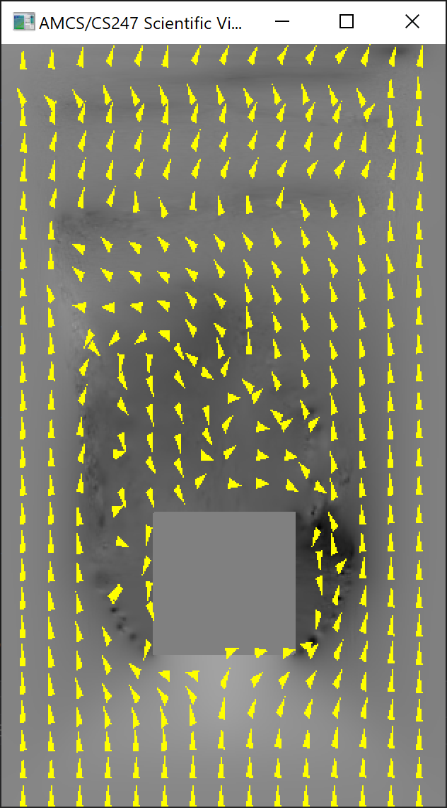
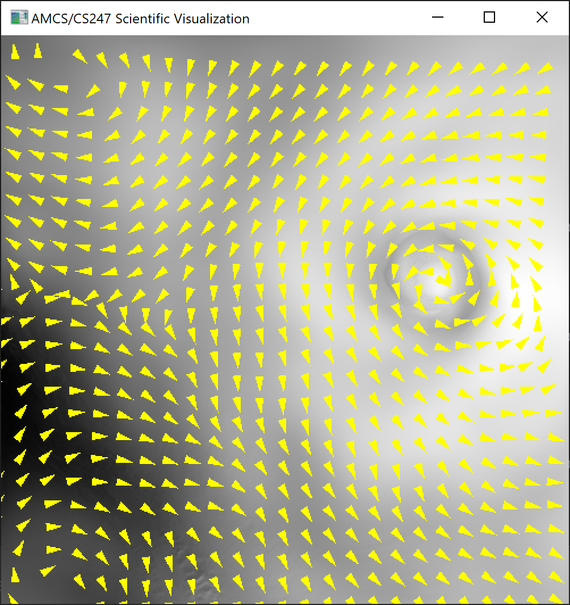
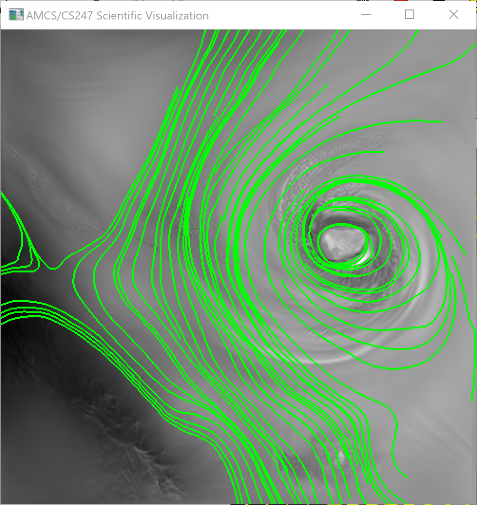
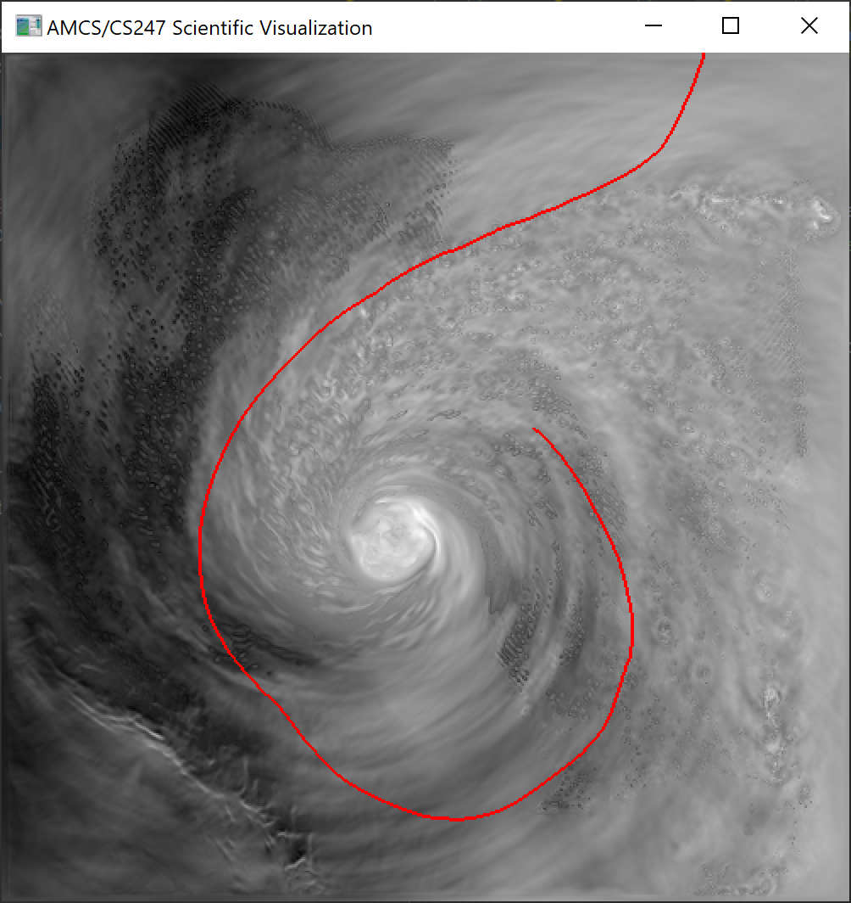

# Assignment 5

## Basic Tasks
- Vector field visualization in 2D using glyphs
- Streamline integration using Euler and Runge-Kutta methods
- Pathline integration using Euler and Runge-Kutta methods

## Minimum Requirements
- Glyph visualization: draw glyphs (arrows or something that indicate direction)
    - Adjustable length: choose between arrows with constant length or arrows with the length depending on the speed (vector magnitude)
    - Change (sub)sampling rate for arrows or glyphs (vector grid)
- Streamlines using a) Euler and b) RK2
    - Every time you seed a point keep the streamline of that point (don't reset streamlines)
    - When you change a time-slice the streamline should update correctly (recalculate)
    - Do bilinear interpolation of vectors (don't snap to nearest vector)
    - Stopping condition depends on the accumulated length of the streamline or if the queried vector is almost zero or if you hit a boundary
    - Do backward integration with forward integration
- Pathlines using a) Euler and b) RK2
    - Every time you seed a point keep the pathline of that point (don't reset pathlines)
    - Do trilinear interpolation of vectors (don't snap to nearest vector and timeslice)
    - Stopping condition depends on the accumulated length of the streamline or if the queried vector is almost zero or if you hit a boundary
    - Do backward integration with forward integration
- Adjustable dt value by user

## Bonus
- Release multiple streamline seeds in horizontal or vertical rake
- RK4 for both streamlines ~~and pathlines~~

Each seed point (mouse or rake) is stored in `std::vector<int> seed_point`.
The streamlines of the seed points are stored in `std::vector<int> streamline_point`.
The pathlines of the seed points are stored in `std::vector<int> pathline_point`.
```c++
// compute streamline points only when needed, do not recalculate the seed points' streamlines that where previously calcullated
// i.e. enable streamline, seed some points (streamline points calculated), disable streamline, seed some points,
// enable streamline again (calculate streamlines only for the new seed points)
if (draw_streamline) {
    for (int i = streamline_point.size() / 2; i < seed_point.size(); i += 2) {
        computeStreamline(seed_point[i], seed_point[i+1]);
    }
}
```





