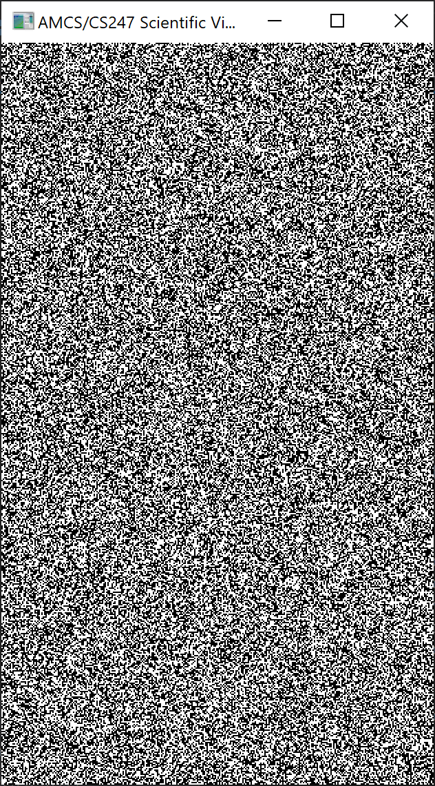
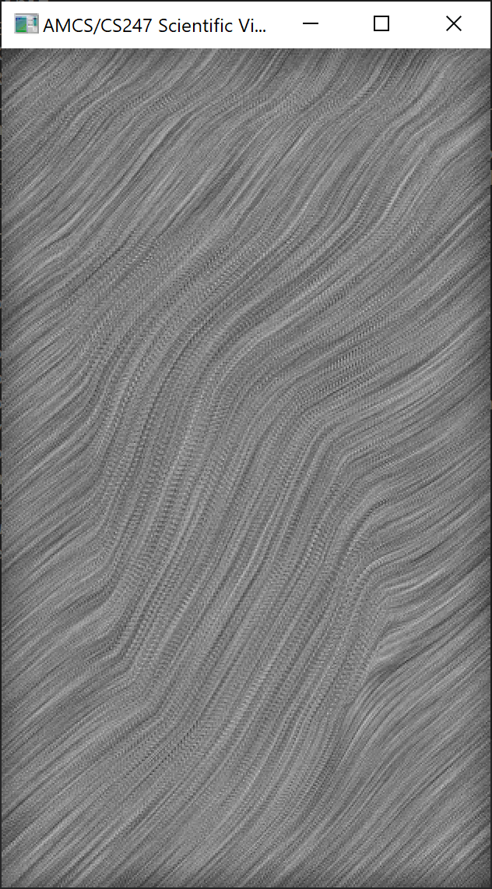
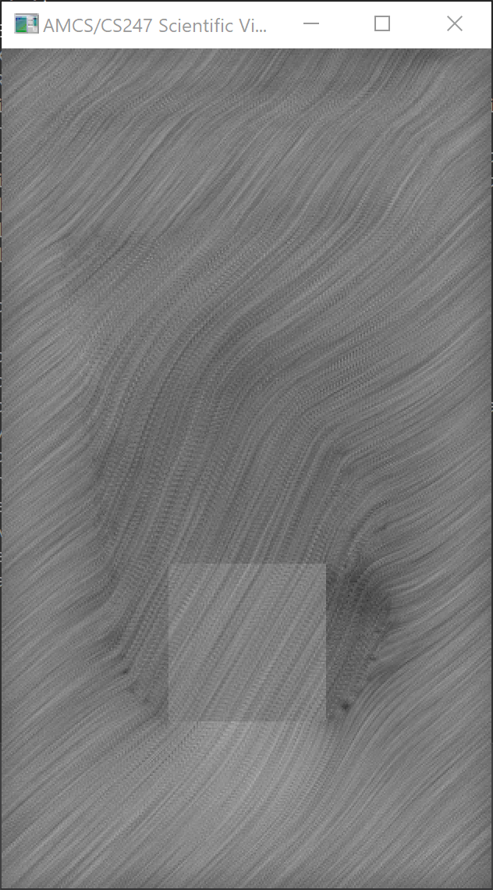
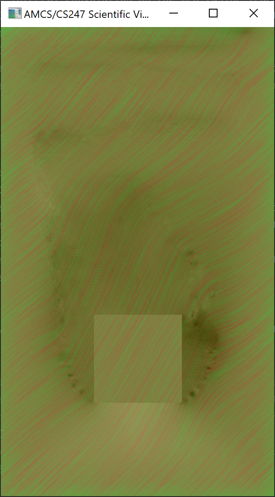

# Assignment 6

## Basic Tasks
- Implement Line Integral Convolution on the GPU (using fragment shaders).
    - Perform LIC in the fragment shader using a noisefield texture and a vector-field texture as input.
    - Render the result on a screen filling quad.
- Overlay a scalar field.
    - Render the provided scalar fields at a time and blend it over the LIC field.
    - Either use a separate render pass or combine the scalar field and the LIC in the same fragment shader.
    - Use color mapping for the scalar field.

## Minimum Requirements
- GPU‐based LIC using GLSL
    - Generate binary noise image (0, 1) to be used for LIC
- Extension of GPU‐based LIC using GLSL
    - User adjustable kernel size for LIC (use a uniform variable)
    - Do backward Integration along with the forward integration
- Scalar field overlay plus color mapping.
    - Use either a color map texture, like the transfer function for volume rendering, OR interpolate a few constant colors manually (e.g. green -> yellow -> red) in the shader.
    - User adjustable blend factor (use a uniform variable)

## Notes
Note that when we load the data to the GPU (shaders) the vectors will be between 0-1, you will need to adjust it to include negative values as well.

